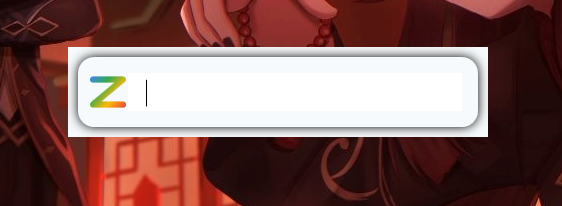

# ZeroSrc

Selamat datang di **ZeroSrc**! Panduan ini akan membantu Anda menginstal, menggunakan, dan menghapus aplikasi ZeroSrc dengan mudah.

## 🚀 Fitur Terbaru

- **🔍 Smart Launcher Otomatis**  
  Ketik nama aplikasi (misal: `notepad`, `vscode`, `youtube`) dan ZeroSrc langsung membukanya tanpa konfigurasi tambahan.

- **🖥️ Deteksi Aplikasi Desktop Otomatis**  
  ZeroSrc otomatis mendeteksi semua aplikasi dari Start Menu Anda.

- **💻 Shortcut Desktop Otomatis**  
  Ketik `desktop shortcuts` untuk membuka semua shortcut aplikasi di desktop.

- **🔄 Pembaruan Shortcut Instan**  
  Tekan `F5` untuk me-refresh daftar aplikasi secara real-time.

---

## 📥 Cara Instalasi

1. **Unduh** ZeroSrc dari [sumber resmi](https://github.com/faizinuha/ZeroSrc/Release).
2. **Ekstrak** file ZIP ke folder tujuan.
3. **Jalankan** `ZeroSrc.exe` dengan klik dua kali.
4. Ikuti instruksi di layar untuk mulai menggunakan fitur ZeroSrc.

---

## 💡 Cara Penggunaan

- Ketik nama aplikasi di ZeroSrc untuk membukanya.
- Gunakan fitur shortcut dan pembaruan otomatis sesuai kebutuhan.

---

## 🔗 Download Aplikasi ZeroSrc

- [GitHub Repository](https://github.com/faizinuha/ZeroSrc)
- [Releases Page](https://github.com/faizinuha/ZeroSrc/releases)
- [🌐 ZeroSrc Official Website](https://faizinuha.github.io/ZeroSrc/)

Pastikan mengunduh versi terbaru untuk fitur dan perbaikan terbaru.

---

## ❌ Cara Uninstall

1. Tutup aplikasi ZeroSrc jika sedang berjalan.
2. Hapus folder instalasi ZeroSrc dari komputer Anda.
3. Pastikan tidak ada proses ZeroSrc yang berjalan:
   - Buka **Task Manager** (`Ctrl + Shift + Esc`)
   - Cari `ZeroSrc.exe`
   - Klik kanan > **End Task** jika masih aktif.

> 💡 **Tips:** Pastikan semua instance ZeroSrc tertutup agar aplikasi benar-benar terhapus.

---
## 🛠️ Gambar
<!-- Gambar ini menunjukkan tampilan ZeroSrc -->

---

## Terima Kasih!
Kami berharap panduan ini membantu Anda dalam menggunakan ZeroSrc. Jika ada pertanyaan atau masalah, silakan buka [issue di GitHub](https://github.com/faizinuha/ZeroSrc/issues).
Terima kasih telah menggunakan ZeroSrc!