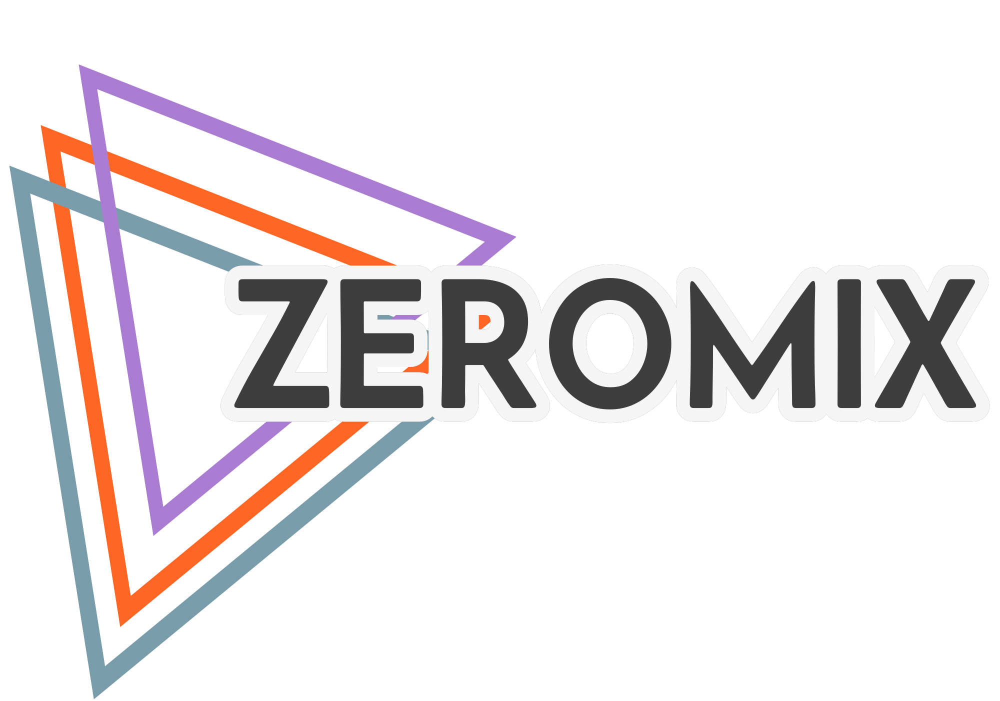

<div align="center">



# 🎯 ZeroMix

**The Ultimate Windows Suite for Performance & Aesthetics**

[](https://github.com/faizinuha/ZeroMix/releases)
[](LICENSE.txt)
[](https://dotnet.microsoft.com/)
[](https://trakteer.id/MyCici)

[📥 Download Now](https://github.com/faizinuha/ZeroMix/releases) • [🎥 Video Demo](https://www.youtube.com/watch?v=y9yz7ZPh_Bo) • [📖 Documentation](https://github.com/faizinuha/ZeroMix/wiki) • [💬 Community](https://github.com/faizinuha/ZeroMix/discussions)

---

**ZeroMix** is a high-performance, lightweight utility suite designed to transform your Windows experience. From real-time system monitoring to immersive video wallpapers and a **Lua-powered plugin system**, ZeroMix brings pro-level tools into a beautiful, modern interface.

[Features](#-core-features) • [Installation](#-quick-installation) • [Shortcuts](#-keyboard-shortcuts) • [Plugins](#-lua-plugin-system) • [Contributing](#-community--contribution)

</div>

## 🚀 Core Features

ZeroMix is packed with features that keep your system fast and your desktop stunning.

| Feature                  | Description                                                             |
| :----------------------- | :---------------------------------------------------------------------- |
| **🧩 Lua Plugin system** | Create and share your own plugins using simple Lua scripts!             |
| **🎥 ZeroRecord**        | **(HOT)** Screen recording with dynamic zoom based on cursor movement.  |
| **📊 System Monitor**    | Real-time tracking of CPU, RAM, and Disk directly from your dashboard.  |
| **🎨 Ghost Taskbar**     | Instantly make your taskbar transparent for a clean, professional look. |
| **🎬 Video Wallpaper**   | Immersive animated wallpapers with high-performance video engine.       |
| **🔍 Search Overlay**    | High-performance search bar (`Alt + Space`) for apps, files, and web.   |
| **🧹 Memory Optimizer**  | Smart background GC collection and working set trimming.                |

---

## 🎥 Zerorecord & Preview

<div style="left: 0; margin-bottom: 20px; text-align: center">
      <video src="https://github.com/user-attachments/assets/0a5c1928-32b8-4b32-a391-aefdb5b3d2f5" width="1000"  autoplay muted loop></video>
    </div>

## 🧩 Lua Plugin System

Empower your ZeroMix experience by creating your own modules. No C# knowledge required!

1.  **Open Extensions**: Click the "Buat Plugin" button in the dashboard.
2.  **Scaffold**: Choose Private or Public. ZeroMix creates the folder automatically.
3.  **Code**: Open `script.lua` in Notepad and start coding!
4.  **BOM!**: Your plugin is instantly loaded into the system.

```lua
function OnLoad()
    ZeroMix.Log("Hello from my first plugin!")
    ZeroMix.Notify("ZeroMix", "Plugin Loaded Successfully!")
end
```

---

## 📥 Quick Installation

Ready to upgrade your desktop? Follow these simple steps:

1.  **Download**: Grab the latest `.exe` from the [Official Releases](https://github.com/faizinuha/ZeroMix/releases).
2.  **Install**: Run the setup. ZeroMix will guide you through the process.
3.  **Launch**: Find the ⚡ icon in your system tray.
4.  **Startup**: ZeroMix will ask to run on startup via a terminal prompt on your first run.

> [!TIP] > **No Admin? No Problem.** ZeroMix is designed to run with user-level permissions, making it safe and easy to use on any machine.

---

## ⌨️ Keyboard Shortcuts

Workflow is everything. Master ZeroMix with these shortcuts:

- **`Ctrl + Space`** : Open Search Overlay (Apps, Web, Files)
- **`Ctrl + Q`** : Toggle Main Dashboard
- **`Ctrl + R`** : Force Refresh System Metrics
- **`Esc`** : Close Active Overlay/Window

---

## 🛠️ Built With

High-performance technologies for a smooth experience.

- **Frontend**: WPF (Windows Presentation Foundation)
- **Core**: .NET 9.0 (C#)
- **Scripting**: MoonSharp (Lua Engine)
- **Engine**: FFmpeg for Video Processing
- **Optimization**: Native Windows API (User32.dll), Active GC Trimming

---

## 🤝 Community & Contribution

ZeroMix is an open-source project, and we love our contributors!

- **Found a bug?** Open an [Issue](https://github.com/faizinuha/ZeroMix/issues).
- **Have an idea?** Start a [Discussion](https://github.com/faizinuha/ZeroMix/discussions).
- **Want to code?** Check our [Contributing Guide](CONTRIBUTING.md).

### Contributors

<a href="https://github.com/faizinuha/ZeroMix/graphs/contributors">
  
</a>

---

## 🎬 Credits & Acknowledgments

The atmospheric experiences in ZeroMix are powered by beautiful visuals from the creative community:

- **Rainy City at Night** by [Hans](https://pixabay.com/id/users/hans-2/) dari [Pixabay](https://pixabay.com/)
- **Nature & Garden Ambience** by [Nicky ❤️🌿🐞🌿❤️](https://pixabay.com/id/users/nickype-10327513/) dari [Pixabay](https://pixabay.com/)
- **Cinematic Scenery 1** by [Andreas](https://pixabay.com/id/users/adege-4994132/?content=257240) dari [Pixabay](https://pixabay.com/)
- **Cinematic Scenery 2** by [Andreas](https://pixabay.com/id/users/adege-4994132/?content=230317) dari [Pixabay](https://pixabay.com/)

### 🎭 Live2D Models

- **Frieren & Fern Model** by [kyokiStudio](https://kyoki.booth.pm/) on Booth.pm

> [!IMPORTANT]
> **Kebijakan Penghapusan (Removal Policy):** Jika Model ini tidak diperbolehkan untuk digunakan dalam aplikasi, mohon segera hubungi kami melalui Email: **Rozakadm@gmail.com**. Kami akan segera menghapus model tersebut untuk menghormati hak pemilik dan memastikan kenyamanan bagi semua pihak. Terima kasih.

> [!NOTE]
> Jika ingin mendownload model, harap gunakan **situs resmi yang telah kami sediakan**. Mohon hargai kerja keras pembuat model. Jangan menggunakan model ini untuk **komersial atau dijual tanpa izin**. Terima kasih atas pengertiannya! 🥰

> [!NOTE]
> Penggunaan model ini sepenuhnya menjadi tanggung jawab pengguna.
> Pengembang aplikasi tidak menyediakan izin komersial apa pun atas model ini dan hanya meneruskan ketentuan dari pembuat asli.

> [!WARNING]
> Pengembang aplikasi tidak bertindak sebagai pemberi lisensi model.
> Penggunaan yang melanggar ketentuan pembuat asli merupakan tanggung jawab pengguna.

---


---

## 💖 Support the Project

ZeroMix is free and open source. If you find it useful, please consider starring the repository or supporting development via Trakteer.

<div align="center">

[](https://trakteer.id/MyCici)

</div>

---

<div align="center">
  Made with ❤️ by <b>Faizinuha</b> and the community. <br/>
  <b>ZeroMix © 2025-2026</b>
</div>
