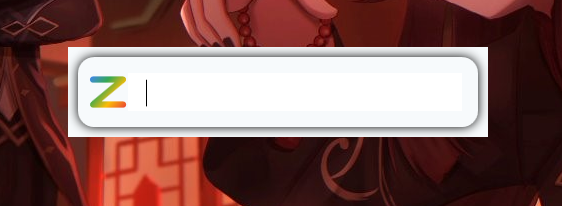

# ZeroSrc

Selamat datang di **ZeroSrc**! Panduan ini akan membantu Anda menginstal, menggunakan, dan menghapus aplikasi ZeroSrc dengan mudah.

## 🚀 Fitur Terbaru

- **🔍 Smart Launcher Otomatis**  
  Ketik nama aplikasi (misal: `notepad`, `vscode`, `youtube`) dan ZeroMix langsung membukanya tanpa konfigurasi tambahan.

- **🖥️ Deteksi Aplikasi Desktop Otomatis**  
  ZeroMix otomatis mendeteksi semua aplikasi dari Start Menu Anda.

- **💻 Shortcut Desktop Otomatis**  
  Ketik `desktop shortcuts` untuk membuka semua shortcut aplikasi di desktop.

---

## 📥 Cara Instalasi

1. **Unduh** ZeroSrc dari [sumber resmi](https://github.com/faizinuha/ZeroSrc/Release).
2. **Ekstrak** file ZIP ke folder tujuan.
3. **Jalankan** `ZeroSrc.exe` dengan klik dua kali.
4. Ikuti instruksi di layar untuk mulai menggunakan fitur ZeroSrc.

---

## Changelog

### Versi 1.0.0

- Rilis awal dengan fitur Smart Launcher, deteksi aplikasi otomatis, dan shortcut desktop otomatis.

---

### versi 1.1.0

- Tidak ada Pembarui Segnifikan

---

### versi 1.2.0 - 1.3.0, 1.4.0

- Tidak ada Pembarui Segnifikan

---

### versi 1.5.5

- Perbaikan Bug Minor
- Peningkatan Performa Aplikasi
- penambahan Fitur Dark Mode (Cooming soon)
- peningkatan UI/UX

---

### versi 1.6.0

- ???

---

### versi 1.6.1 - 1.6.5

- ???

---

### versi 1.7.0

- ???

---

### versi 1.7.1 - 1.7.5

- ???

---

## Coming Soon Update

- Menyangkut Semua version di Atas di bawah ini Termasuk Non Segnifikan
- Penambahan Fitur Pembaruan Otomatis (Coming Soon)
- Penambahan Fitur Kustomisasi Shortcut (Coming Soon)

## ⚙️ Persyaratan Sistem

- Sistem Operasi: Windows 10 atau lebih baru
- RAM: Minimal 2GB
- Ruang Disk: Minimal 100MB
- .NET Framework: Versi 4.7.2 atau lebih baru
- Koneksi Internet: Diperlukan untuk pembaruan otomatis(Cooming soon Feature)
- Izin Administrator: Tidak diperlukan

---

## 💡 Cara Penggunaan

- Ketik nama aplikasi di ZeroSrc untuk membukanya.
- Gunakan fitur shortcut dan pembaruan otomatis sesuai kebutuhan.

---

## 🔗 Download Aplikasi ZeroSrc

- [GitHub Repository](https://github.com/faizinuha/ZeroSrc)
- [Releases Page](https://github.com/faizinuha/ZeroSrc/releases)
- [🌐 ZeroSrc Official Website](https://faizinuha.github.io/ZeroSrc/)

Pastikan mengunduh versi terbaru untuk fitur dan perbaikan terbaru.

---

## ❌ Cara Uninstall

1. Tutup aplikasi ZeroSrc jika sedang berjalan.
2. Hapus folder instalasi ZeroSrc dari komputer Anda.
3. Pastikan tidak ada proses ZeroSrc yang berjalan:
   - Buka **Task Manager** (`Ctrl + Shift + Esc`)
   - Cari `ZeroSrc.exe`
   - Klik kanan > **End Task** jika masih aktif.

> 💡 **Tips:** Pastikan semua instance ZeroSrc tertutup agar aplikasi benar-benar terhapus.

---

## 🛠️ Gambar
<!-- Gambar ini menunjukkan tampilan ZeroMix -->

---

## Terima Kasih

Donate untuk mendukung pengembangan ZeroMix:

- [Saweria](saweria.co/MahiroDev)
- [Ko-Fi](https://ko-fi.com/mahiro885)

Kami berharap panduan ini membantu Anda dalam menggunakan ZeroMix. Jika ada pertanyaan atau masalah, silakan buka [issue di GitHub](https://github.com/faizinuha/ZeroMix/issues).
Terima kasih telah menggunakan ZeroMix!
