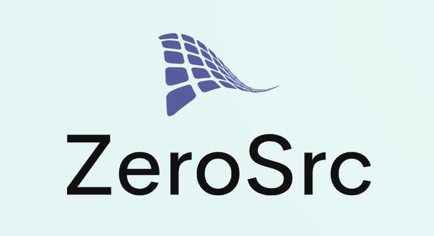

# ZeroMix

Selamat datang di **ZeroMix**! Panduan ini akan membantu Anda menginstal, menggunakan, dan menghapus aplikasi ZeroMix dengan mudah.

## 🚀 Fitur Terbaru (v1.6.0)

ZeroMix kini lebih cerdas dan intuitif! Kami telah merombak sistem pencarian untuk memberikan pengalaman yang lebih mulus.

- **Pencarian Terintegrasi**: Cari aplikasi lokal dan web secara bersamaan dalam satu tempat.
- **UI yang Informatif**: Hasil pencarian kini dikelompokkan berdasarkan kategori ("Aplikasi Desktop" & "Pencarian Web") dan dilengkapi ikon untuk identifikasi cepat.
- **Logika `Enter` yang Cerdas**: Tekan `Enter` untuk langsung memilih saran teratas, membuat alur kerja Anda lebih cepat.
- **Perbaikan Stabilitas**: Menghilangkan berbagai bug untuk pengalaman yang lebih lancar.

Penasaran dengan fitur barunya? **Tonton video demo di sini!** (Link akan diperbarui)

---

## Changelog

### Versi 1.0.0

- Rilis awal dengan fitur Smart Launcher, deteksi aplikasi otomatis, dan shortcut desktop otomatis.

---

### versi 1.1.0

- Tidak ada Pembarui Segnifikan

---

### versi 1.2.0 - 1.3.0, 1.4.0

- Tidak ada Pembarui Segnifikan

---

### versi 1.5.5

- Perbaikan Bug Minor
- Peningkatan Performa Aplikasi
- penambahan Fitur Dark Mode (Cooming soon)
- peningkatan UI/UX

---

### Versi 1.6.0

- **Peningkatan UI/UX:**
  - Menambahkan ikon untuk membedakan antara Aplikasi Desktop (💻) dan Pencarian Web (🔍).
  - Mengelompokkan hasil pencarian ke dalam kategori "Aplikasi Desktop" dan "Pencarian Web" agar lebih rapi.
  - **Tampilan Jendela Modern**: Mengadopsi efek *blur* (frosted glass) dan bingkai halus ala macOS untuk tampilan yang lebih elegan dan profesional.
- **Perbaikan Logika Pencarian:**
  - Memperbaiki bug di mana menekan `Enter` langsung mencari di web. Sekarang, `Enter` akan memprioritaskan saran yang ada di daftar.
  - Menghilangkan bug "auto-enter" yang langsung menjalankan perintah saat memilih saran dengan tombol panah.
- **Peningkatan Stabilitas:** Berbagai perbaikan kecil untuk meningkatkan stabilitas dan pengalaman pengguna secara keseluruhan.

---

### Versi 1.6.0 - 1.6.6

- **Prioritas Saran Cerdas:** Mengimplementasikan sistem untuk menampilkan aplikasi yang paling sering digunakan di urutan teratas.
- **Kustomisasi Tampilan:** Menambahkan opsi untuk mengubah urutan kategori (misalnya, Pencarian Web di atas Aplikasi Desktop).
- **Optimasi Performa:** Peningkatan kecepatan dalam memuat dan menampilkan daftar aplikasi, terutama untuk pengguna dengan banyak program terinstal.
- **Pembaruan Otomatis**: ZeroMix kini dapat memeriksa dan menginstal pembaruan secara otomatis, memastikan Anda selalu menggunakan versi terbaru dengan perbaikan dan fitur terkini.
- **Manajemen Shortcut Kustom**:
  - **Jendela Khusus**: Menambahkan antarmuka baru untuk membuat dan mengelola pintasan keyboard kustom.
  - **Perekaman Hotkey Intuitif**: Merekam hotkey kini lebih mudah. Cukup tekan kombinasi tombol yang diinginkan (misal: `Ctrl+V`), dan sistem akan merekamnya secara otomatis.
  - **Penemuan Aplikasi Cerdas**: Mempermudah pemilihan aplikasi dengan menampilkan daftar aplikasi yang terinstal dari Start Menu dan Desktop secara otomatis.
  - **Peningkatan UI/UX (Dalam Pengembangan)**: Antarmuka untuk fitur ini masih dalam tahap awal. Peningkatan desain dan pengalaman pengguna akan menjadi fokus pada versi 1.7.0.
  
---

---

### Versi 1.7.0

- ???

---

### versi 1.7.1 - 1.7.5

- ???

---

## Coming Soon Update

- Menyangkut Semua version di Atas di bawah ini Termasuk Non Segnifikan
- Penambahan Fitur Kustomisasi Shortcut (Coming Soon)

## ⚙️ Persyaratan Sistem

- Sistem Operasi: Windows 10 atau lebih baru
- RAM: Minimal 2GB
- Ruang Disk: Minimal 100MB
- .NET: .NET 9.0 atau lebih baru (berdasarkan proyek Anda)
- Koneksi Internet: Diperlukan untuk fitur pembaruan otomatis dan pencarian web.
- Izin Administrator: Tidak diperlukan

---

## 💡 Cara Penggunaan

- Ketik nama aplikasi di ZeroMix untuk membukanya.
- Gunakan fitur shortcut dan pembaruan otomatis sesuai kebutuhan.

---

## 🔗 Download Aplikasi ZeroMix

- [GitHub Repository](https://github.com/faizinuha/ZeroMix)
- [Releases Page](https://github.com/faizinuha/ZeroMix/releases)
- [🌐 ZeroMix Official Website](https://faizinuha.github.io/ZeroMix/)

Pastikan mengunduh versi terbaru untuk fitur dan perbaikan terbaru.

---

## ❌ Cara Uninstall

1. Tutup aplikasi ZeroMix jika sedang berjalan.
2. Hapus folder instalasi ZeroMix dari komputer Anda.
3. Pastikan tidak ada proses ZeroMix yang berjalan:
   - Buka **Task Manager** (`Ctrl + Shift + Esc`)
   - Cari `ZeroMix.exe`
   - Klik kanan > **End Task** jika masih aktif.

> 💡 **Tips:** Pastikan semua instance ZeroMix tertutup agar aplikasi benar-benar terhapus.

---

## 🛠️ Gambar
<!-- Gambar ini menunjukkan tampilan ZeroMix -->

---

## Terima Kasih

Donate untuk mendukung pengembangan ZeroMix:

- [Saweria](saweria.co/MahiroDev)
- [Ko-Fi](https://ko-fi.com/mahiro885)

Kami berharap panduan ini membantu Anda dalam menggunakan ZeroMix. Jika ada pertanyaan atau masalah, silakan buka [issue di GitHub](https://github.com/faizinuha/ZeroMix/issues).
Terima kasih telah menggunakan ZeroMix!
